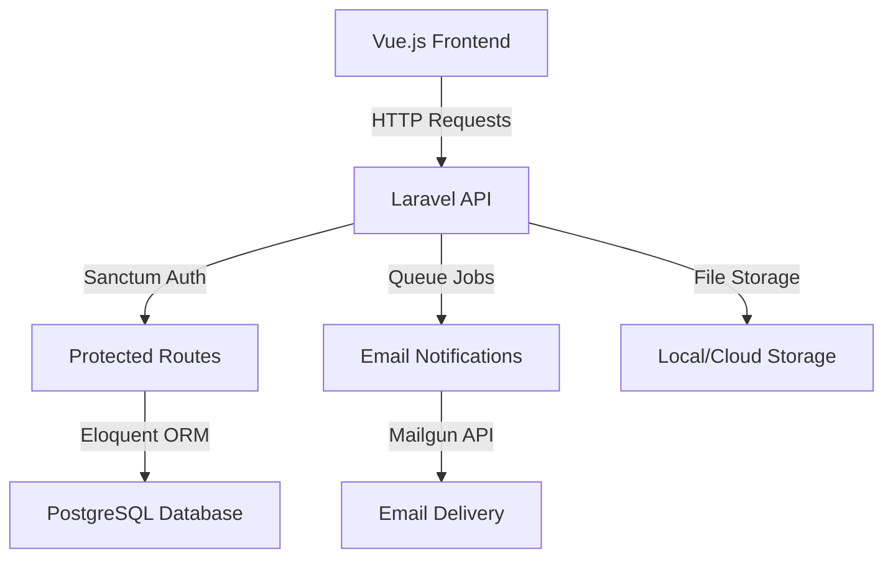

# 📋 Task Management System

> A modern, full-stack task management application built with Laravel 11 and Vue.js 3, featuring comprehensive email notifications, role-based access control, and responsive design.

[](https://laravel.com)
[](https://vuejs.org)
[](https://www.typescriptlang.org)
[](https://vuetifyjs.com)
[](LICENSE)

## 🌟 Live Demo

- **🌐 Frontend**: [task-management-frontend.vercel.app](https://task-manager-lac-tau.vercel.app)
- **📚 API Docs**: [API Documentation](https://task-manager-api-nwrn.onrender.com/api/documentation)
- **📧 Email**: Powered by Mailgun with custom domain support

## 🚀 Features

### 🔐 Authentication & Authorization
- **Secure Authentication**: Laravel Sanctum with JWT tokens
- **Role-Based Access Control**: Admin and User roles with granular permissions
- **User Registration**: Welcome email notifications for new users
- **Profile Management**: Users can update their personal information

### 📋 Task Management
- **Complete CRUD Operations**: Create, read, update, and delete tasks
- **Task Assignment**: Admins can assign tasks to specific users
- **Status Tracking**: Track progress (Pending, In Progress, Completed)
- **Deadline Management**: Set and monitor task deadlines with reminders
- **My Tasks View**: Users see only their assigned tasks
- **Admin Dashboard**: Comprehensive overview of all tasks and users

### 📧 Email Notification System
- **Task Assignment Notifications**: Automatic emails when tasks are assigned
- **Task Update Notifications**: Alerts when tasks are modified
- **Task Reminder Notifications**: Automated deadline reminders
- **Welcome Emails**: Onboarding emails for new users
- **Email Preferences Management**: Users control which notifications they receive
- **Mailgun Integration**: Professional email delivery with tracking

### 🎛️ Email Preferences Management
- **User Preference Controls**: Toggle switches for each notification type
- **Admin Preference Management**: Admins can manage all users' preferences
- **Preference Statistics**: Dashboard showing adoption rates
- **Real-time Updates**: Instant saving of preference changes
- **Default Settings**: Sensible defaults for new users

### 🖥️ Modern Frontend (Vue.js 3)
- **Responsive Design**: Mobile-first approach with Vuetify components
- **Dark/Light Theme**: User-selectable themes with persistence
- **Real-time Updates**: Reactive UI with Pinia state management
- **Form Validation**: Comprehensive validation with VeeValidate
- **Toast Notifications**: User feedback with vue-toastification
- **TypeScript Support**: Full type safety throughout the application

## 🛠️ Tech Stack

### Backend
- **Framework**: Laravel 11.x
- **Authentication**: Laravel Sanctum with API tokens
- **Database**: SQLite (configurable to MySQL/PostgreSQL)
- **Email Service**: Mailgun with Laravel Notifications
- **Queue System**: Database queues for email processing
- **API Documentation**: Swagger/OpenAPI 3.0
- **Testing**: PHPUnit

### Frontend
- **Framework**: Vue.js 3 with Composition API
- **UI Library**: Vuetify 3 (Material Design)
- **State Management**: Pinia
- **Routing**: Vue Router 4
- **HTTP Client**: Axios
- **Form Validation**: VeeValidate
- **Notifications**: Vue Toastification
- **Build Tool**: Vite
- **Language**: TypeScript

### DevOps & Deployment
- **Frontend Hosting**: Vercel (configured)
- **Email Service**: Mailgun
- **Version Control**: Git with conventional commits
- **Package Management**: Composer (PHP), npm (Node.js)

## 📋 Requirements

### Backend Requirements
- PHP 8.2+
- Composer 2.x
- SQLite (or MySQL/PostgreSQL)
- PHP Extensions: PDO, OpenSSL, Mbstring, Tokenizer, XML, Ctype, JSON

### Frontend Requirements
- Node.js 18+
- npm or yarn
- Modern web browser with ES6+ support

### Email Service (Optional but Recommended)
- Mailgun account for production email delivery
- Custom domain for professional email sending

## 🚀 Quick Start

### 📋 Prerequisites
- **PHP** 8.2+ with extensions: PDO, OpenSSL, Mbstring, Tokenizer, XML, Ctype, JSON
- **Node.js** 18+ and npm
- **Composer** 2.x
- **Git** for version control

### 🔧 Installation

#### 1️⃣ Clone the Repository
```bash
git clone https://github.com/Cleve-codes/task-management.git
cd task-management
```

#### 2️⃣ Backend Setup (Laravel API)
```bash
cd backend

# Install dependencies
composer install

# Environment setup
cp .env.example .env
php artisan key:generate

# Database setup
php artisan migrate
php artisan db:seed

# Start development server
php artisan serve
```

#### 3️⃣ Frontend Setup (Vue.js)
```bash
cd frontend

# Install dependencies
npm install

# Environment setup
cp .env.example .env.local

# Start development server
npm run dev
```

#### 4️⃣ Email Configuration (Production)
```bash
# Update backend/.env with your Mailgun credentials
MAIL_MAILER=mailgun
MAILGUN_DOMAIN=your-vercel-app.vercel.app
MAILGUN_SECRET=your-mailgun-secret
MAIL_FROM_ADDRESS=noreply@your-vercel-app.vercel.app
MAIL_FROM_NAME="Task Management System"
```

### 🌐 Access Points
| Service | URL | Description |
|---------|-----|-------------|
| **Frontend** | http://localhost:3000 | Vue.js application |
| **Backend API** | http://127.0.0.1:8000/api | Laravel API |
| **API Docs** | http://127.0.0.1:8000/api/documentation | Swagger UI |
| **Health Check** | http://127.0.0.1:8000/api/health | API status |

### 🔐 Default Credentials
```bash
# Admin User
Email: admin@example.com
Password: password

# Regular User
Email: user@example.com
Password: password
```

> ⚠️ **Security Note**: Change default passwords immediately in production!

## 📚 API Documentation

### Authentication Endpoints
- `POST /api/register` - User registration with welcome email
- `POST /api/login` - User login with token generation
- `POST /api/logout` - User logout and token revocation
- `GET /api/user` - Get current authenticated user

### Task Management Endpoints
- `GET /api/tasks` - Get all tasks (role-based filtering)
- `GET /api/my-tasks` - Get user's assigned tasks
- `POST /api/tasks` - Create new task (admin only) with email notification
- `GET /api/tasks/{id}` - Get specific task details
- `PUT /api/tasks/{id}` - Update task with change notifications
- `PATCH /api/tasks/{id}/status` - Update task status
- `DELETE /api/tasks/{id}` - Delete task (admin only)

### User Management Endpoints (Admin Only)
- `GET /api/users` - Get all users with pagination
- `POST /api/users` - Create new user
- `GET /api/users/{id}` - Get specific user details
- `PUT /api/users/{id}` - Update user information
- `DELETE /api/users/{id}` - Delete user account

### Email Preferences Endpoints
- `GET /api/email-preferences` - Get current user's email preferences
- `PUT /api/email-preferences` - Update current user's email preferences
- `GET /api/users/{id}/email-preferences` - Get user's preferences (admin only)
- `PUT /api/users/{id}/email-preferences` - Update user's preferences (admin only)
- `GET /api/admin/email-preferences/overview` - Get preferences overview with statistics (admin only)

## 🧪 Testing

### Frontend Testing
```bash
cd frontend
npm run test        # Run unit tests
npm run test:e2e    # Run end-to-end tests
npm run lint        # Run ESLint
npm run type-check  # TypeScript type checking
```

### Backend Testing
```bash
cd backend
php artisan test                    # Run PHPUnit tests
php artisan test --coverage        # Run tests with coverage
vendor/bin/phpstan analyse         # Static analysis
```

### API Testing with Postman
1. Import the collection: `backend/postman_collection.json`
2. Set environment variable: `base_url = http://127.0.0.1:8000/api`
3. Register/Login to get authentication tokens
4. Test all endpoints including email preferences

### API Testing with Swagger UI
1. Visit: http://127.0.0.1:8000/api/documentation
2. Click "Authorize" and enter: `Bearer YOUR_TOKEN`
3. Test endpoints directly from the browser
4. Explore the new email preferences endpoints

### Email Testing
```bash
cd backend
php artisan queue:work              # Process email queue
php artisan tinker                  # Test email notifications manually
```

## 🔧 Configuration

### Backend Environment Variables
Key environment variables in `backend/.env`:
```env
APP_NAME="Task Management System"
APP_URL=http://localhost:8000
DB_CONNECTION=sqlite

# Email Configuration
MAIL_MAILER=mailgun
MAILGUN_DOMAIN=your-domain.com
MAILGUN_SECRET=your-mailgun-secret
MAILGUN_ENDPOINT=api.mailgun.net
MAIL_FROM_ADDRESS=noreply@your-domain.com
MAIL_FROM_NAME="Task Management System"

# Queue Configuration
QUEUE_CONNECTION=database

# Frontend URL (for email links)
FRONTEND_URL=http://localhost:3000
```

### Frontend Environment Variables
Key environment variables in `frontend/.env.local`:
```env
VITE_API_BASE_URL=http://127.0.0.1:8000/api
VITE_APP_NAME="Task Management System"
```

### Database Configuration
The application uses SQLite by default. To use MySQL/PostgreSQL:
1. Update `backend/.env` database configuration
2. Run migrations: `php artisan migrate`
3. Seed the database: `php artisan db:seed`

### Email Service Setup
1. **Create Mailgun Account**: Sign up at mailgun.com
2. **Add Domain**: Add your domain to Mailgun
3. **Configure DNS**: Set up SPF, DKIM, and DMARC records
4. **Update Environment**: Add Mailgun credentials to `.env`
5. **Test Email**: Use the email preferences system to test

## 🏗️ Project Architecture

### 📁 Monorepo Structure
```
task-management/
├── 📂 backend/                  # Laravel 11 API Backend
│   ├── 📂 app/
│   │   ├── 📂 Console/Commands/ # Artisan Commands
│   │   │   └── SendTaskReminders.php
│   │   ├── 📂 Http/Controllers/ # API Controllers
│   │   │   ├── AuthController.php
│   │   │   ├── TaskController.php
│   │   │   ├── UserController.php
│   │   │   └── EmailPreferencesController.php
│   │   ├── 📂 Models/           # Eloquent Models
│   │   │   ├── User.php
│   │   │   └── Task.php
│   │   ├── 📂 Notifications/    # Email Notifications
│   │   │   ├── WelcomeNotification.php
│   │   │   ├── TaskAssignedNotification.php
│   │   │   ├── TaskUpdatedNotification.php
│   │   │   └── TaskReminderNotification.php
│   │   └── 📂 Enums/           # Application Enums
│   │       ├── UserRole.php
│   │       └── TaskStatus.php
│   ├── 📂 database/
│   │   ├── 📂 migrations/       # Database Schema
│   │   ├── 📂 seeders/          # Sample Data
│   │   └── 📂 factories/        # Model Factories
│   ├── 📂 resources/views/emails/ # Email Templates
│   │   ├── welcome.blade.php
│   │   ├── task-assigned.blade.php
│   │   ├── task-updated.blade.php
│   │   └── task-reminder.blade.php
│   ├── 📂 routes/
│   │   ├── api.php              # API Routes
│   │   └── auth.php             # Auth Routes
│   ├── 📂 config/               # Configuration
│   ├── 📄 Dockerfile            # Docker Configuration
│   ├── 📄 composer.json         # PHP Dependencies
│   └── 📄 postman_collection.json # API Testing
│
├── 📂 frontend/                 # Vue.js 3 Frontend
│   ├── 📂 src/
│   │   ├── 📂 components/       # Reusable Components
│   │   │   ├── 📂 admin/        # Admin Components
│   │   │   ├── 📂 auth/         # Auth Components
│   │   │   ├── 📂 common/       # Shared Components
│   │   │   └── 📂 user/         # User Components
│   │   ├── 📂 views/            # Page Components
│   │   │   ├── 📂 Admin/        # Admin Pages
│   │   │   ├── 📂 Auth/         # Auth Pages
│   │   │   └── 📂 User/         # User Pages
│   │   ├── 📂 stores/           # Pinia State Management
│   │   │   ├── auth.ts
│   │   │   ├── tasks.ts
│   │   │   └── theme.ts
│   │   ├── 📂 services/         # API Services
│   │   │   ├── api.ts
│   │   │   ├── auth.ts
│   │   │   └── tasks.ts
│   │   ├── 📂 router/           # Vue Router
│   │   ├── 📂 utils/            # Utilities
│   │   └── 📂 types/            # TypeScript Types
│   ├── 📂 public/               # Static Assets
│   ├── 📄 vercel.json           # Vercel Config
│   ├── 📄 package.json          # Dependencies
│   └── 📄 tsconfig.json         # TypeScript Config
│
├── 📄 README.md                 # This file
├── 📄 .gitignore               # Git ignore rules
```

### 🔄 Data Flow Architecture


## 🚀 Deployment Guide

### 🌐 Frontend Deployment (Vercel)

#### Automatic Deployment
```bash
cd frontend

# Install Vercel CLI
npm install -g vercel

# Deploy to Vercel
vercel

# Follow prompts:
# - Link to existing project or create new
# - Set build command: npm run build
# - Set output directory: dist
```

#### Manual Deployment
1. **Build the project**: `npm run build`
2. **Upload `dist/` folder** to your hosting provider
3. **Configure environment variables** in hosting dashboard

#### Environment Variables (Vercel)
```bash
VITE_API_BASE_URL=https://your-api.onrender.com/api
VITE_APP_NAME=Task Management System
```

### 🖥️ Backend Deployment

#### Option 1: Render (Recommended)
```bash
# 1. Connect GitHub repository to Render
# 2. Create new Web Service
# 3. Configure build settings:
#    - Build Command: composer install --no-dev
#    - Start Command: php artisan serve --host=0.0.0.0 --port=$PORT
```

#### Option 2: Railway
```bash
# 1. Connect GitHub repository to Railway
# 2. Add PostgreSQL database
# 3. Configure environment variables
# 4. Deploy automatically on push
```

#### Option 3: Docker Deployment
```bash
cd backend

# Build Docker image
docker build -t task-management-api .

# Run container
docker run -p 8000:8000 task-management-api
```

### 📧 Email Domain Setup

#### Step 1: Get Your Vercel Domain
After deploying frontend, you'll get a URL like: `your-app.vercel.app`

#### Step 2: Configure Mailgun
1. **Add Domain** to Mailgun dashboard
2. **Get DNS Records** (SPF, DKIM, DMARC)
3. **Add Records** to your domain DNS settings
4. **Verify Domain** in Mailgun

#### Step 3: Update Environment Variables
```bash
# In your backend hosting platform (Render/Railway)
MAILGUN_DOMAIN=your-app.vercel.app
MAIL_FROM_ADDRESS=noreply@your-app.vercel.app
FRONTEND_URL=https://your-app.vercel.app
```

### 🔄 CI/CD Pipeline

#### GitHub Actions (Optional)
```yaml
# .github/workflows/deploy.yml
name: Deploy
on:
  push:
    branches: [main]
jobs:
  deploy-frontend:
    runs-on: ubuntu-latest
    steps:
      - uses: actions/checkout@v2
      - name: Deploy to Vercel
        uses: amondnet/vercel-action@v20
```

## 🎯 Key Features Showcase

### Email Preferences Management
- **User Control**: Users can toggle email notifications on/off
- **Admin Overview**: Admins see adoption rates and can manage all users
- **Real-time Updates**: Changes save instantly with visual feedback
- **Professional Templates**: Mobile-responsive email designs

### Task Management
- **Intuitive Interface**: Clean, modern design with Vuetify components
- **Role-based Views**: Different interfaces for admins and users
- **Status Tracking**: Visual indicators for task progress
- **Deadline Management**: Color-coded deadlines with reminder system

### Responsive Design
- **Mobile-first**: Optimized for all screen sizes
- **Dark/Light Themes**: User preference with system detection
- **Accessibility**: WCAG compliant with keyboard navigation
- **Performance**: Optimized loading with lazy components

## 🔧 Troubleshooting

### Common Issues

#### Email Not Sending
```bash
# Check queue status
php artisan queue:work --once

# Check failed jobs
php artisan queue:failed

# Clear failed jobs
php artisan queue:flush
```

#### Frontend Build Issues
```bash
# Clear node modules and reinstall
rm -rf node_modules package-lock.json
npm install

# Check for TypeScript errors
npm run type-check
```

#### Database Issues
```bash
# Reset database
php artisan migrate:fresh --seed

# Check database connection
php artisan tinker
>>> DB::connection()->getPdo()
```

### Performance Optimization
- **Backend**: Use Redis for caching and queues in production
- **Frontend**: Enable gzip compression and CDN
- **Database**: Add indexes for frequently queried columns
- **Email**: Use queue workers for background email processing


### Development Guidelines
- Follow conventional commit messages
- Add tests for new features
- Update documentation for API changes
- Ensure TypeScript types are properly defined

### Dashboard Views
- **User Dashboard**: Clean interface showing assigned tasks
- **Admin Dashboard**: Comprehensive overview with statistics
- **Task Management**: Intuitive task creation and editing
- **Email Preferences**: User-friendly preference controls

### Responsive Design
- **Mobile Optimized**: Full functionality on all devices
- **Dark/Light Themes**: Seamless theme switching
- **Accessibility**: Keyboard navigation and screen reader support

### Live Demo
- **Frontend Demo**: [task-manager-lac-tau.vercel.app](https://task-manager-lac-tau.vercel.app)
- **API Documentation**: [API Documentation](https://task-manager-api-nwrn.onrender.com/api/documentation)
- **Test Credentials**: Use the default credentials provided above

## � Current Deployment Status

### 🌐 Production Environment
| Service | Status | URL | Notes |
|---------|--------|-----|-------|
| **Frontend** | ✅ Deployed | [Vercel](https://task-manager-lac-tau.vercel.app) | Vue.js 3 + Vuetify |
| **Backend API** | ✅ Deployed | [Render](https://task-manager-api-nwrn.onrender.com) | Laravel 11 + PostgreSQL |
| **Database** | ✅ Active | Render PostgreSQL | Managed database |
| **Email Service** | ✅ Configured | Mailgun | Custom domain ready |
| **API Docs** | ✅ Available | [Swagger UI](https://task-manager-api-nwrn.onrender.com/api/documentation) | Interactive docs |

### 🔧 Configuration Status
- ✅ **Authentication**: Laravel Sanctum with API tokens
- ✅ **Email Notifications**: Mailgun integration with custom domain support
- ✅ **Queue System**: Database queues for background jobs
- ✅ **File Storage**: Local storage (ready for cloud upgrade)
- ✅ **CORS**: Configured for frontend-backend communication
- ✅ **Environment**: Production-ready configuration

## 🔄 Version History & Changelog

### v2.1.0 (Current - Production Ready)
- ✅ **Full Production Deployment**: Both frontend and backend deployed
- ✅ **Email System**: Complete notification system with Mailgun
- ✅ **Custom Domain Support**: Ready for professional email delivery
- ✅ **Database Migration**: PostgreSQL in production
- ✅ **Security Hardening**: Production environment variables
- ✅ **Performance Optimization**: Queue system for email processing
- ✅ **API Documentation**: Complete Swagger documentation
- ✅ **Monitoring**: Health check endpoints

### v2.0.0 (Feature Complete)
- ✅ **Vue.js 3 Frontend**: Complete responsive application
- ✅ **Email Preferences**: User-controlled notification settings
- ✅ **TypeScript Integration**: Full type safety
- ✅ **Modern UI/UX**: Vuetify 3 with dark/light themes
- ✅ **State Management**: Pinia for reactive state
- ✅ **Form Validation**: VeeValidate integration

### v1.0.0 (MVP)
- ✅ **Laravel API Backend**: RESTful API with authentication
- ✅ **Task Management**: CRUD operations for tasks
- ✅ **User Authentication**: Registration and login
- ✅ **Role-Based Access**: Admin and user permissions
- ✅ **Database Design**: Normalized schema with relationships


## 👨‍💻 Author & Maintainer

<div align="center">

### **Cleve Momanyi**
*Full-Stack Developer & Software Engineer*

[](https://github.com/Cleve-codes)
[](https://linkedin.com/in/cleve-momanyi)
[](mailto:clevemomanyi@gmail.com)

</div>

### 🛠️ Built With Passion
This project represents a comprehensive full-stack application showcasing:
- **Modern Web Technologies**: Laravel 11, Vue.js 3, TypeScript
- **Production-Ready Features**: Email notifications, role-based access, responsive design
- **DevOps Best Practices**: Docker, CI/CD, cloud deployment
- **Professional Development**: Clean code, testing, documentation

## 🙏 Acknowledgments

### Backend Technologies
- **Laravel Framework** - Robust PHP framework
- **Laravel Sanctum** - API authentication
- **Mailgun** - Email delivery service
- **Swagger/OpenAPI** - API documentation

### Frontend Technologies
- **Vue.js 3** - Progressive JavaScript framework
- **Vuetify 3** - Material Design component library
- **Pinia** - State management
- **Vite** - Build tool and development server
- **TypeScript** - Type safety

### Development Tools
- **Vercel** - Frontend hosting and deployment
- **Render** - Backend hosting and deployment
- **GitHub** - Version control and collaboration

